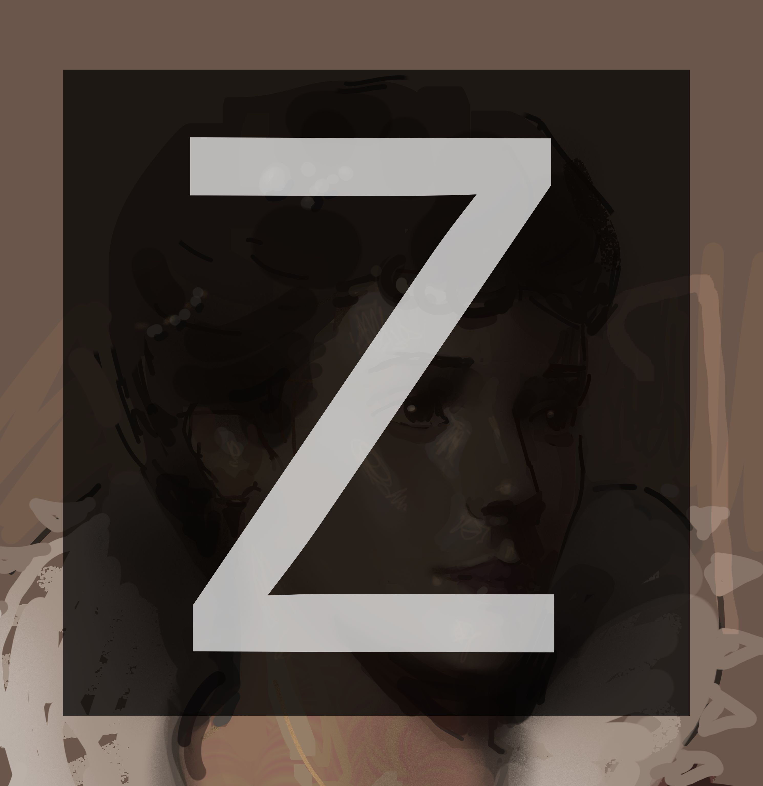

# Zssork Krita Tools

   

Collection of scripts that I use for my painting workflow in Krita.

> [!WARNING]
> 
> The shortcuts might be conflicting with your current shortcuts so make sure to resolve any conflicts! The plugin shortcuts can also be changed in `Settings > Keyboard Shortcuts`
> 

- Line tool (`SHIFT`)
  - Quickly change to line tool with one button press (similar to photoshop)
  - Option to keep current opacity settings as well for convenience
- Toggle Primary/Secondary Brush (`F`)
  - Allows switching between two configured brushes quickly
  - _Note: I use it to change between **Hard Round** and **Airbrush** (because ten brush script feels a bit clumsy sometimes and this is only one simple button press. You can also configure the plugin to toggle between the last selected and the secondary brush)_
- Increase/Decrease Brush Size
  - Modifies the brush size (`C`/`V`)
  - _Note: the default Krita actions are constant and not proportional to current brush size_
- Increase/Decrease Opacity
  - Modifies the opacity (`A`/`S`)
  - _Note: configurable modifier_
- Smart Toggle Pressure (`Y`)
  - On: Sets opacity to 100% and activates pressure
  - Off: Deactivate pressure and switch to previous opacity 
  - _Note: with pressure sensitivity I always want 100% opacity as well_
- Toggle Opacity (`D`)
  - On: Sets opacity to 100%
  - Off: Switch to previous opacity

> I also use the [Separate Brush and Eraser](https://github.com/ollyisonit/krita-separate-brush-eraser) plugin with Brush (B) and Eraser (E)

## Plugin Installation

Download the [ZssorkTools.zip](https://github.com/Readock/ZssorkTools/releases/download/latest/ZssorkTools.zip) file and install it by going to `Tools > Scripts > Import Python Plugin From File...` in Krita. 

After a restart there should be a new menu under `Tools > Scripts > Zssork`. Open the settings there and select your primary/secondary brushes. If you want to change the shortcuts you can find them in the normal Krita Settings Shortcut section. 

If you're having issues, more information on plugin installation can be found [here](https://docs.krita.org/en/user_manual/python_scripting/install_custom_python_plugin.html).

### My Config (Optional)
If you also want to have my layout and shortcuts. Download the [Config.zip](https://github.com/Readock/ZssorkTools/releases/download/latest/Config.zip) file and place the files in your krita resource folder:

- zssork.kws => krita/workspaces
- zssork.profile => krita/input
- zssork.shortcuts => krita/shortcuts
- zssork-theme.colors => krita/color-schemes

### My Brushes (Optional)

If you want to have my brushes, you can import the [zssork.bundle](https://github.com/Readock/ZssorkTools/releases/download/latest/Zssork.bundle) file into krita